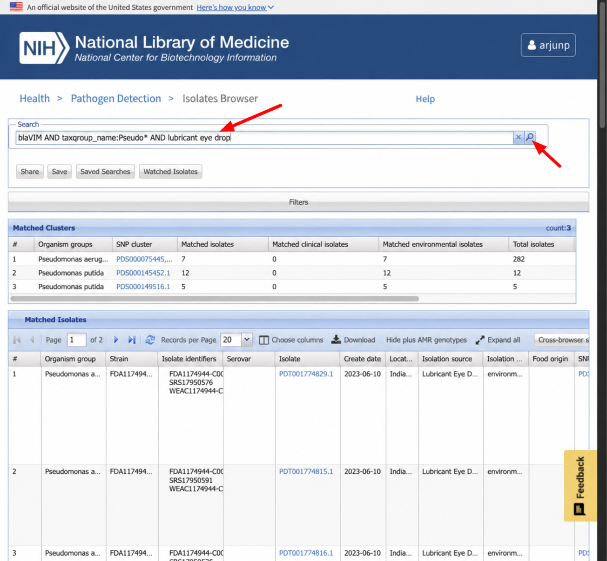
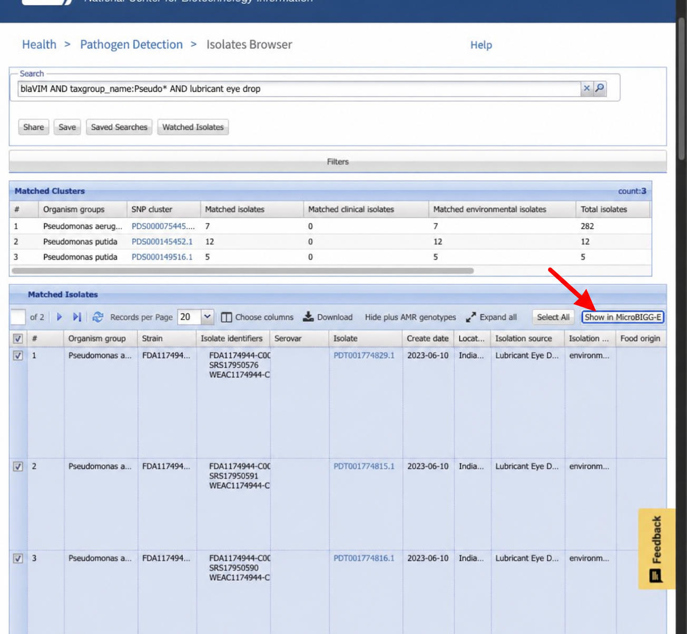
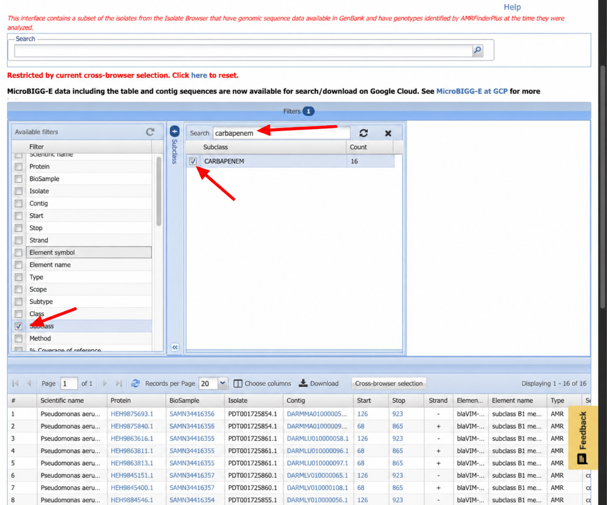
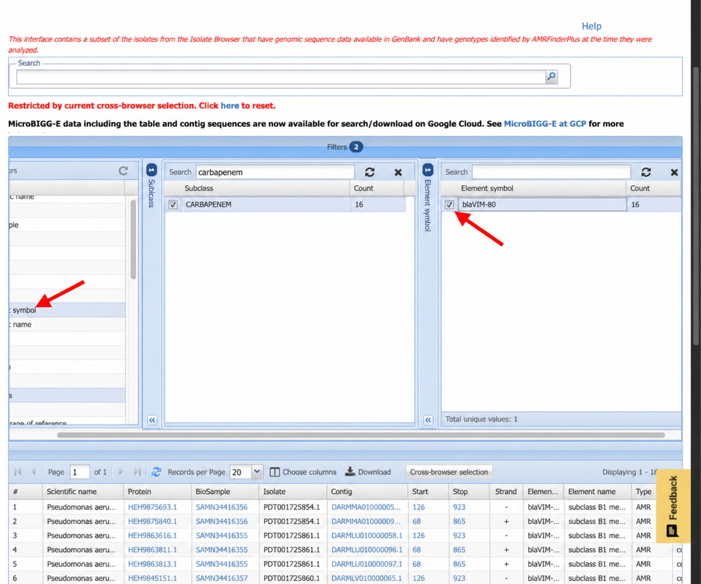

# Antibiotic resistance: exploring resistance genes and comparing phenotypes

Explore antimicrobial resistance in _Pseudomonas aeruginosa_ using NCBI Pathogen Detection. First, investigate carbapenem resistance genes in isolates associated with contaminated eye drops. Then, compare quinolone-associated AMRFinderPlus results with laboratory ciprofloxacin antibiotic susceptibility test (AST) results.

## Background: AMRFinderPlus and Pathogen Detection AMR resources

[AMRFinderPlus](https://www.ncbi.nlm.nih.gov/pathogens/antimicrobial-resistance/AMRFinder/) is NCBI's freely available tool for identifying antimicrobial resistance (AMR) genes and resistance-associated point mutations in assembled nucleotide sequences and/or protein annotations. It uses curated reference sequences and hidden Markov models (HMMs) to identify and name resistance elements. The “Plus” includes selected stress response and virulence genes.

NCBI runs AMRFinderPlus as part of the Pathogen Detection pipeline and makes the results available through its browsers. Both exercises use those precomputed results; you do not need to run AMRFinderPlus yourself.

The [National Database of Antibiotic Resistant Organisms (NDARO)](https://www.ncbi.nlm.nih.gov/pathogens/antimicrobial-resistance/) brings together NCBI's AMR data and tools. Several complementary resources support these exercises:

| Resource | What it provides |
| --- | --- |
| [Isolates Browser](https://www.ncbi.nlm.nih.gov/pathogens/isolates/) | Isolate metadata and summaries of detected resistance, stress response, and virulence elements. |
| [MicroBIGG-E](https://www.ncbi.nlm.nih.gov/pathogens/microbigge/) | Detailed AMRFinderPlus results for individual genetic elements, linked to their source isolates. |
| [AST Browser](https://www.ncbi.nlm.nih.gov/pathogens/ast/) | Submitted laboratory susceptibility measurements and interpretations. |
| [Reference Gene Catalog](https://www.ncbi.nlm.nih.gov/pathogens/refgene/) | Curated reference genes and mutations used to characterize resistance elements. |
| [Reference Gene Hierarchy](https://www.ncbi.nlm.nih.gov/pathogens/genehierarchy/) | The classification and naming hierarchy used by AMRFinderPlus. |
| [Reference HMM Catalog](https://www.ncbi.nlm.nih.gov/pathogens/hmm/) | Curated hidden Markov models used by AMRFinderPlus to identify protein families associated with antimicrobial resistance, stress response, and virulence. |

**Genotype** describes the resistance-associated genes and mutations detected in an isolate. **Phenotype** describes its measured response to an antibiotic. Comparing them helps us explore which markers, or combinations of markers, are associated with resistance. A detected marker does not always translate directly into a resistant phenotype, and the absence of a reported marker does not establish susceptibility.

## Exercise overview

1. **Explore carbapenem resistance in eye-drop isolates.** Search the Isolates Browser, transfer matching isolates to MicroBIGG-E, and use filters to discover the VIM resistance allele.
2. **Compare genotypes and phenotypes.** Download ciprofloxacin AST results and quinolone-associated resistance elements, then use the [AMRgen R package](https://amrgen.org/) through a supplied script to compare them in an UpSet plot.

You will need an NCBI account for cross-browser selection in both exercises. Exercise 2 also requires access to the workshop Jupyter environment for the R analysis.

## Exercise 1: explore carbapenem resistance in eye-drop isolates

Carbapenem-resistant _Pseudomonas aeruginosa_ (CRPA) was associated with the [2022–2023 U.S. outbreak linked to artificial tears](https://archive.cdc.gov/www_cdc_gov/hai/outbreaks/crpa-artificial-tears.html). Investigators connected an extensively drug-resistant outbreak strain to contaminated eye drops. In this exercise, you will examine matching isolates and use their AMRFinderPlus annotations to identify a gene associated with carbapenem resistance.

### 1. Sign in and search the Isolates Browser

Open the [Isolates Browser](https://www.ncbi.nlm.nih.gov/pathogens/isolates/) and click **Log in** in the upper-right corner. Sign in to your NCBI account, or create an account if needed.

Enter this query in the search bar:

```text
blaVIM AND taxgroup_name:Pseudo* AND lubricant eye drop
```

You can also [open the search results](https://www.ncbi.nlm.nih.gov/pathogens/isolates/#blaVIM%20AND%20taxgroup_name%3APseudo%2A%20AND%20lubricant%20eye%20drop). The query combines a VIM gene-family term, a wildcard organism-group search, and terms describing the eye-drop source. Because `Pseudo*` is a wildcard, results can include other _Pseudomonas_ groups, such as _P. putida_, as well as _P. aeruginosa_.



### 2. Inspect a matching isolate

Choose one matching record to inspect. Look at its **Isolation source** and **AMR genotypes** fields: how does the source relate to the eye-drop investigation, and which resistance markers are reported? If needed, use **Choose columns** to display these fields.

Keep the full set of search results for the next step. You will transfer all matching isolates, not just the record you inspected.

> Search results can change as data are added or updated. Use the available records rather than expecting a fixed number of isolates.

### 3. View all matching isolates in MicroBIGG-E

Click **Cross-browser selection**, then confirm that all matching isolates remain selected. All search results are selected by default; do not limit the selection to the single record you inspected.

Choose **Show in MicroBIGG-E**. A new tab opens with available AMRFinderPlus results for the selected isolates. Each row represents a detected genetic element rather than an isolate, so an isolate can contribute multiple rows. See the [NCBI browser help](https://www.ncbi.nlm.nih.gov/pathogens/pathogens_help/) for details about cross-browser selection and filters.



### 4. Filter for carbapenem resistance elements

In the new MicroBIGG-E tab:

1. Open the **Filters** panel.
2. Select **Subclass**.
3. Type `carbapenem` in the filter search box.
4. Select **CARBAPENEM**.

Keep the transferred isolate selection active while applying this filter. The table now focuses on elements annotated as associated with carbapenem resistance in those isolates.



### 5. Discover the VIM allele

With the **CARBAPENEM** filter still active, open the **Element symbol** filter. Inspect the available symbols and identify the VIM allele. Select that symbol to display its matching rows in the table, then examine the **Element symbol** and **Element name** annotations.



### 6. Interpret the results

- What is the full element symbol of the VIM gene you found?
- What does its **CARBAPENEM** subclass tell you, and how does that differ from an AST measurement?

<details>
<summary>Check your answer</summary>

The expected allele for this outbreak example is **`blaVIM-80`**, which encodes a VIM-family metallo-beta-lactamase. Its **CARBAPENEM** annotation identifies it as a resistance determinant associated with that antibiotic subclass.

This is a sequence-based annotation, not a measured susceptibility result for the isolate. AST measures the isolate's response to an antibiotic under laboratory conditions. Exercise 2 explores how genotype annotations and measured phenotypes relate to one another.

The expected allele reflects the documented outbreak; the records and filter choices available in the live browsers may change.

</details>

## Exercise 2: compare ciprofloxacin genotypes and phenotypes

### Part 1: download phenotype data

#### 1. Sign in and open the AST Browser

Go to the [Pathogen Detection homepage](https://www.ncbi.nlm.nih.gov/pathogens/) and click **Log in** in the upper-right corner. Sign in to your NCBI account, or create an account if needed.

Open the [Antibiotic Susceptibility Test (AST) Browser](https://www.ncbi.nlm.nih.gov/pathogens/ast/).


#### 2. Filter for ciprofloxacin and Pseudomonas aeruginosa

Open the **Filters** panel.


Select the **Antibiotic** filter.


Type `cipro` in the filter search box, then select **ciprofloxacin**. The table will now show AST results for that antibiotic.


Select the **Organism group** filter, then choose **Pseudomonas aeruginosa**.


Alternatively, enter this query in the search bar or [open the filtered results](https://www.ncbi.nlm.nih.gov/pathogens/ast#taxgroup_name:%22Pseudomonas%20aeruginosa%22%20AND%20ANTIBIOTICS:%22ciprofloxacin%22):

```text
taxgroup_name:"Pseudomonas aeruginosa" AND ANTIBIOTICS:"ciprofloxacin"
```

Collapsing the **Filters** panel shows the query generated by your selections.

> The original workshop example contained 9,009 AST entries from 9,003 isolates. Counts can change as records are added or updated, and one isolate can have multiple AST entries.

#### 3. Download the AST table

Click **Download**, choose **Tab-delimited (.tsv)**, and save the file as `asts.tsv`.


### Part 2: download genotype data for the same isolates

#### 4. Open the selected isolates in MicroBIGG-E

In the AST Browser, click **Cross-browser selection**. This feature requires you to be signed in to NCBI.


Choose **Show in MicroBIGG-E**.


A new tab opens with available MicroBIGG-E results restricted to isolates from your filtered AST results. Each row represents a detected genetic element, so the number of rows will differ from the AST table. MicroBIGG-E results require public assembly accessions; some isolates in Pathogen Detection may not yet have results available there.

#### 5. Filter for quinolone-associated elements

1. Open the **Filters** panel.
2. Select **Subclass**.
3. Type `quinolone` in the filter search box.
4. Select all subclasses containing `QUINOLONE`.


#### 6. Add the Hierarchy node ID column

The comparison script uses **Hierarchy node ID** when importing resistance elements into AMRgen. Include it in the table before downloading.

1. Click **Choose columns** in the table header.
2. Click the **Available columns** header to sort the list alphabetically.
3. Find **Hierarchy node ID** and drag it to **Selected columns**.
4. Click **OK**.


#### 7. Download the MicroBIGG-E table

Click **Download**, choose **Tab-delimited (.tsv)**, and save the file as `microbigge.tsv`.

Keep the default columns as well as **Hierarchy node ID**: the script relies on the exported column names.

### Part 3: compare genotypes and phenotypes

[AMRgen](https://amrgen.org/) provides tools for combining resistance genotypes with susceptibility data and visualizing their relationships. The supplied `compare_amr.R` script imports the two tables and compares quinolone-associated markers with ciprofloxacin phenotypes, using BioSample identifiers to connect the data.

#### 8. Upload the data to Jupyter

Open the [workshop Jupyter environment](https://jupyterhub01.ncbi.nlm.nih.gov/). Navigate to your working directory and use the upload button to upload `asts.tsv` and `microbigge.tsv`.


Also place the supplied [compare_amr.R](compare_amr.R) script in that directory. If you are using a checkout of this repository in Jupyter, the script is already in the `amr` directory; upload your tables there.

#### 9. Open a terminal and run the script

Open a terminal tab and make sure its working directory contains `compare_amr.R`, `asts.tsv`, and `microbigge.tsv`.


Run:

```bash
Rscript compare_amr.R \
   --drug=Ciprofloxacin \
   --taxgroup="Pseudomonas aeruginosa" \
   --drug_class_list="Quinolones" \
   --phenotypes=asts.tsv \
   --genotypes=microbigge.tsv
```

The script requires R and the `optparse`, `dplyr`, `AMRgen`, `AMR`, and `ggplot2` packages. These instructions assume the workshop environment has the required packages installed. By default, the script uses CLSI interpretations; it also accepts `--standard=eucast`.

#### 10. Inspect the plot

Open the generated `Rplots.pdf` in Jupyter. Compare it with the [example plot](https://raw.githubusercontent.com/ncbi/workshop-asm-big-2026/refs/heads/main/images/Rplots.pdf); your results may differ as the underlying data change.

The UpSet plot summarizes combinations of resistance markers and their associated phenotypes. Use it to explore:

- Which marker combinations are most common?
- How do ciprofloxacin minimum inhibitory concentrations (MICs) vary between combinations?
- Do isolates with the same marker combination always have the same susceptibility category?
- What might explain differences between genotype and phenotype?

A minimum inhibitory concentration is the lowest tested antibiotic concentration that inhibits visible growth. Interpret the plot in the context of the available measurements, the selected interpretation standard, and the resistance mechanisms represented in the genotype data.
