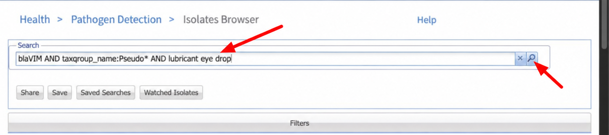

# Antibiotic resistance: exploring resistance genes and comparing phenotypes

## Contents

- [Exercise 1: explore carbapenem resistance in eye-drop isolates](#exercise-1-explore-carbapenem-resistance-in-eye-drop-isolates)
- [Exercise 2: compare ciprofloxacin genotypes and phenotypes](#exercise-2-compare-ciprofloxacin-genotypes-and-phenotypes)
- [Exercise 3: run AMRFinderPlus on a Staphylococcus epidermidis genome](#exercise-3-run-amrfinderplus-on-a-staphylococcus-epidermidis-genome)

Explore antimicrobial resistance in _Pseudomonas aeruginosa_ using NCBI Pathogen Detection. First, investigate carbapenem resistance genes in isolates associated with contaminated eye drops. Then, compare quinolone-associated AMRFinderPlus results with laboratory ciprofloxacin antibiotic susceptibility test (AST) results. Finally, download a _Staphylococcus epidermidis_ genome and run AMRFinderPlus yourself.

## Background: AMRFinderPlus and Pathogen Detection AMR resources

[AMRFinderPlus](https://www.ncbi.nlm.nih.gov/pathogens/antimicrobial-resistance/AMRFinder/) is NCBI's freely available tool for identifying antimicrobial resistance (AMR) genes and resistance-associated point mutations in assembled nucleotide sequences and/or protein annotations. It uses curated reference sequences and hidden Markov models (HMMs) to identify and name resistance elements. The “Plus” includes selected stress response and virulence genes.

NCBI runs AMRFinderPlus as part of the Pathogen Detection pipeline and makes the results available through its browsers. Exercises 1 and 2 use those precomputed results. In the final project, you will run AMRFinderPlus on a genome outside Pathogen Detection's analyses.

The [National Database of Antibiotic Resistant Organisms (NDARO)](https://www.ncbi.nlm.nih.gov/pathogens/antimicrobial-resistance/) brings together NCBI's AMR data and tools. Several complementary resources support these exercises:

| Resource | What it provides |
| --- | --- |
| [Isolates Browser](https://www.ncbi.nlm.nih.gov/pathogens/isolates/) | Isolate metadata and summaries of detected resistance, stress response, and virulence elements. |
| [MicroBIGG-E](https://www.ncbi.nlm.nih.gov/pathogens/microbigge/) | Detailed AMRFinderPlus results for individual genetic elements, linked to their source isolates. |
| [AST Browser](https://www.ncbi.nlm.nih.gov/pathogens/ast/) | Submitted laboratory susceptibility measurements and interpretations. |
| [Reference Gene Catalog](https://www.ncbi.nlm.nih.gov/pathogens/refgene/) | Curated reference genes and mutations used to characterize resistance elements. |
| [Reference Gene Hierarchy](https://www.ncbi.nlm.nih.gov/pathogens/genehierarchy/) | The classification and naming hierarchy used by AMRFinderPlus. |
| [Reference HMM Catalog](https://www.ncbi.nlm.nih.gov/pathogens/hmm/) | Curated hidden Markov models used by AMRFinderPlus to identify protein families associated with antimicrobial resistance, stress response, and virulence. |

**Genotype** describes the resistance-associated genes and mutations detected in an isolate. **Phenotype** describes its measured response to an antibiotic. Comparing them helps us explore which markers, or combinations of markers, are associated with resistance. A detected marker does not always translate directly into a resistant phenotype, and the absence of a reported marker does not establish susceptibility.

## Exercise overview

1. **Explore carbapenem resistance in eye-drop isolates.** Search the Isolates Browser, transfer matching isolates to MicroBIGG-E, and use filters to discover the VIM resistance allele.
2. **Compare genotypes and phenotypes.** Download ciprofloxacin AST results and quinolone-associated resistance elements, then use the [AMRgen R package](https://amrgen.org/) through a supplied script to compare them in an UpSet plot.
3. **Final project: run AMRFinderPlus.** Download an assembly and its annotations, run AMRFinderPlus in the Jupyter terminal, and find an aminoglycoside resistance gene in the output.

You will need an NCBI account for cross-browser selection in Exercises 1 and 2. Exercise 2 and the final project also require access to the workshop Jupyter environment. The required software and AMRFinderPlus database are already installed there.

## Exercise 1: explore carbapenem resistance in eye-drop isolates

Carbapenem-resistant _Pseudomonas aeruginosa_ (CRPA) was associated with the [2022–2023 U.S. outbreak linked to artificial tears](https://archive.cdc.gov/www_cdc_gov/hai/outbreaks/crpa-artificial-tears.html). Investigators connected an extensively drug-resistant outbreak strain to contaminated eye drops. In this exercise, you will examine matching isolates and use their AMRFinderPlus annotations to identify a gene associated with carbapenem resistance.

### 1. Sign in and search the Isolates Browser

Open the [Isolates Browser](https://www.ncbi.nlm.nih.gov/pathogens/isolates/). If you're not already logged in, click **Log in** in the upper-right corner. Sign in to your NCBI account, or create an account if needed.

Enter this query in the search bar:

```text
taxgroup_name:Pseudo* AND lubricant eye drop
```

You can also use this [direct link](https://www.ncbi.nlm.nih.gov/pathogens/isolates/#blaVIM%20AND%20taxgroup_name%3APseudo%2A%20AND%20lubricant%20eye%20drop). The query combines a VIM gene-family term, a wildcard organism-group search, and terms describing the eye-drop source. Because `Pseudo*` is a wildcard, results can include other _Pseudomonas_ groups, such as _P. putida_, as well as _P. aeruginosa_.

Note that we use a number of features of the query language here. Multiple search terms combined with `AND` (capitalization is important). Field names (`taxgroup_name:`) with a wildcard (`taxgroup_name:Pseudo*`). And multiple search terms implicitly OR'd together (`lubricant eye drop` is the equivalent of `lubricant OR eye OR drop`).



### 2. Inspect a matching isolate

Choose one matching record to inspect. Look at its **Isolation source** and **AMR genotypes** fields: Which resistance markers are reported? If needed, use **Choose columns** to display these fields.

> Search results can change as data are added or updated. Use the available records rather than expecting a fixed number of isolates.

### 3. View all matching isolates in MicroBIGG-E

Click **Cross-browser selection**, then confirm that all matching isolates remain selected. All search results are selected by default; do not limit the selection to the single record you inspected.

Choose **Show in MicroBIGG-E**. A new tab opens with *all* available AMRFinderPlus results for the selected isolates. Each row represents a detected genetic element rather than an isolate, so an isolate can contribute multiple rows. See the [NCBI browser help](https://www.ncbi.nlm.nih.gov/pathogens/pathogens_help/) for details about cross-browser selection and filters.


### 4. Filter for carbapenem resistance elements

In the new MicroBIGG-E tab:

1. Open the **Filters** panel.
2. Select **Subclass**.
3. Type `carbapenem` in the filter search box.
4. Select **CARBAPENEM**.

Keep the transferred isolate selection active while applying this filter. The table now focuses on elements annotated as associated with carbapenem resistance in those isolates.


### 5. Discover the VIM allele

Look down at the results table. What allele do you see in the **Element symbol** field? With the **CARBAPENEM** filter still active, you can also open the **Element symbol** filter. Inspect the available symbols and identify the VIM allele.

### 6. Interpret the results

- What is the full element symbol of the VIM gene you found?
- What does its **CARBAPENEM** subclass tell you, and how does that differ from an AST measurement?

<details>
<summary>Check your answer</summary>

The expected allele for this outbreak example is **`blaVIM-80`**, which encodes a VIM-family metallo-beta-lactamase. Its **CARBAPENEM** annotation identifies it as a resistance determinant associated with that antibiotic subclass.

> This is a sequence-based annotation, not a measured susceptibility result for the isolate. AST measures the isolate's response to an antibiotic under laboratory conditions. Exercise 2 explores how genotype annotations and measured phenotypes relate to one another.

The expected allele reflects the documented outbreak; the records and filter choices available in the live browsers may change.

</details>

## Exercise 2: compare ciprofloxacin genotypes and phenotypes

In this exercise we're going to examine the phenotypic effect of fluoroquinolone resistance elements on ciprofloxacin antibiotic susceptibility tests (AST) in _Pseudomonas aeruginosa_ using the [AMRgen R package](https://amrgen.org/) from the [ESGEM-AMR working group](https://esgem-amr.amrrules.org/).

### Part 0: Setup

If you haven't already please clone the git repository into your home directory. We will be using some files from there. 

```
cd
git clone https://github.com/ncbi/workshop-asm-big-2026.git
```

### Part 1: download phenotype data

#### 1. Sign in and open the AST Browser

If you're not already logged in, go to the [Pathogen Detection homepage](https://www.ncbi.nlm.nih.gov/pathogens/) and click **Log in** in the upper-right corner. Sign in to your NCBI account, or create an account if needed.

Open the [Antibiotic Susceptibility Test (AST) Browser](https://www.ncbi.nlm.nih.gov/pathogens/ast/).


#### 2. Filter for ciprofloxacin and Pseudomonas aeruginosa

Open the **Filters** panel.


Select the **Antibiotic** filter.


Type `cipro` in the filter search box, then select **ciprofloxacin**. The table will now show AST results for that antibiotic.


Select the **Organism group** filter, then choose **Pseudomonas aeruginosa**.


Alternatively, enter this query in the search bar or [open the filtered results](https://www.ncbi.nlm.nih.gov/pathogens/ast#taxgroup_name:%22Pseudomonas%20aeruginosa%22%20AND%20ANTIBIOTICS:%22ciprofloxacin%22):

```text
taxgroup_name:"Pseudomonas aeruginosa" AND ANTIBIOTICS:"ciprofloxacin"
```

Collapsing the **Filters** panel shows the query generated by your selections.

> The original workshop example contained 9,009 AST entries from 9,003 isolates. Counts can change as records are added or updated, and one isolate can have multiple AST entries.

#### 3. Download the AST table

Click **Download**, choose **Tab-delimited (.tsv)**, and save the file as `asts.tsv`.


### Part 2: download genotype data for the same isolates

#### 4. Open the selected isolates in MicroBIGG-E

In the AST Browser, click **Cross-browser selection**. This feature requires you to be signed in to NCBI.


Choose **Show in MicroBIGG-E**.


A new tab opens with available MicroBIGG-E results restricted to isolates from your filtered AST results. Each row represents a detected genetic element, so the number of rows will differ from the AST table. MicroBIGG-E results require public assembly accessions; some isolates in Pathogen Detection may not yet have results available there.

#### 5. Filter for quinolone-associated elements

1. Open the **Filters** panel.
2. Select **Subclass**.
3. Type `quinolone` in the filter search box.
4. Select all subclasses containing `QUINOLONE`.


#### 6. Add the Hierarchy node ID column

The comparison script uses **Hierarchy node ID** when importing resistance elements into AMRgen. Include it in the table before downloading.

1. Click **Choose columns** in the table header.
2. Click the **Available columns** header to sort the list alphabetically.
3. Find **Hierarchy node ID** and drag it to **Selected columns**.
4. Click **OK**.


#### 7. Download the MicroBIGG-E table

Click **Download**, choose **Tab-delimited (.tsv)**, and save the file as `microbigge.tsv`.

Keep the default columns as well as **Hierarchy node ID**: the script relies on the exported column names.

### Part 3: compare genotypes and phenotypes

[AMRgen](https://amrgen.org/) provides tools for combining resistance genotypes with susceptibility data and visualizing their relationships. The supplied `compare_amr.R` script imports the two tables and compares quinolone-associated markers with ciprofloxacin phenotypes, using BioSample identifiers to connect the data.

> **Which isolates are compared?** The comparison includes only isolates whose BioSample identifiers appear in both the AST table and the filtered MicroBIGG-E table. Because you filtered MicroBIGG-E for quinolone-associated AMR elements, isolates with no reported elements matching those filters are excluded, as are isolates without available MicroBIGG-E results. The plot therefore describes the subset with downloaded quinolone-associated AMR elements, rather than all isolates in the AST table. Excluded isolates should not be assumed to be susceptible.

#### 8. Upload the data to Jupyter

Open the workshop Jupyter environment. Navigate to your working directory and use the upload button to upload `asts.tsv` and `microbigge.tsv`, for convenience please place them in the `workshop-asm-big-2026/amr` directory.


#### 9. Open a terminal 

In Jupyter, click **+** to open a Launcher, then select **Terminal**. A terminal lets you run programs by typing commands. Its **working directory** is the folder where commands look for input files and save output files.


Run each of these commands by typing or pasting it into the terminal and pressing **Enter**:

```bash
cd $HOME/workshop-asm-big-2026/amr
pwd
ls
```

`pwd` prints the working directory's path; `ls` lists its files. Make sure you see `compare_amr.R`, `asts.tsv`, and `microbigge.tsv`. If they are in another folder, use `cd` (change directory) followed by that folder's path. For example, if your working directory is the repository's top-level folder, run `cd amr`. Then run `ls` again.

#### 10. Upload the analysis script

Make sure the supplied [compare_amr.R](compare_amr.R) script is in that directory. If you are using a checkout of this repository in Jupyter, the script should already be in the `amr` directory; upload your tables there.

Or run the following to download it from the GitHub site:

```
curl -fsSLO https://raw.githubusercontent.com/ncbi/workshop-asm-big-2026/refs/heads/edits/amr/compare_amr.R
```

#### 11. Run the analysis script

`compare_amr.R` is a command-line R script that uses the [AMRgen](https://amrgen.org/) package to compare AMRFinderPlus genotype reports to AST phenotype reports. It handles CLSI or EUCAST interpretation of SIR standards, standardization of drug names, and many other issues that come up with doing the comparison.

Copy and paste the entire command below, then press **Enter**. A backslash (`\`) at the end of a line continues the same command on the next line; keep it as the last character on that line, with no spaces after it. Wait for the terminal prompt to return before entering another command.

```bash
Rscript compare_amr.R \
   --drug=Ciprofloxacin \
   --taxgroup="Pseudomonas aeruginosa" \
   --drug_class_list="Quinolones" \
   --phenotypes=asts.tsv \
   --genotypes=microbigge.tsv
```

The script requires R and the `optparse`, `dplyr`, `AMRgen`, `AMR`, and `ggplot2` packages. These instructions assume the workshop environment has the required packages installed. By default, the script uses CLSI interpretations; it also accepts `--standard=eucast`.

> **If something goes wrong:** For a missing-file error, run `pwd` and `ls` to check that you are in the folder containing all three files and that their names match the command. If the terminal shows a `>` continuation prompt after a partial paste, press **Ctrl+C** and paste the complete command again. If `Rscript` is not found, confirm that you are in the workshop Jupyter terminal and ask an instructor for help.

#### 12. Inspect the plot

Open the generated `Rplots.pdf` in Jupyter. Compare it with the [example plot](https://raw.githubusercontent.com/ncbi/workshop-asm-big-2026/refs/heads/main/images/Rplots.pdf); your results may differ as the underlying data change.

The UpSet plot summarizes combinations of resistance markers and their associated phenotypes. Use it to explore:

- Which marker combinations are most common?
- How do ciprofloxacin minimum inhibitory concentrations (MICs) vary between combinations?
- Do isolates with the same marker combination always have the same susceptibility category?
- What might explain differences between genotype and phenotype?

A minimum inhibitory concentration is the lowest tested antibiotic concentration that inhibits visible growth. Interpret the plot in the context of the available measurements, the selected interpretation standard, and the resistance mechanisms represented in the genotype data.

## Exercise 3: run AMRFinderPlus on a Staphylococcus epidermidis genome

Pathogen Detection analyzes selected organism groups, but you can run AMRFinderPlus yourself on other assembled genomes. In this project, you will analyze a _Staphylococcus epidermidis_ genome, which is not currently included among the [Pathogen Detection organism groups with results](https://ftp.ncbi.nlm.nih.gov/pathogen/Results/). You will download the RefSeq assembly [GCF_019329745.1](https://www.ncbi.nlm.nih.gov/datasets/genome/GCF_019329745.1/) (strain B1276912) and its annotations, run AMRFinderPlus, and locate an aminoglycoside resistance gene. The main goal is to learn the workflow for analyzing a genome yourself.

### 1. Open a terminal and create a project directory

Open the workshop Jupyter environment. Use the terminal from Exercise 2, or click **+** to open a Launcher and select **Terminal**. AMRFinderPlus and its database are already installed.

Run the following commands one line at a time, pressing **Enter** after each:

```bash
pwd
mkdir -p GCF_019329745.1
cd GCF_019329745.1
pwd
```

`pwd` shows your current folder. `mkdir -p` creates the project folder if it does not already exist, and `cd` moves into it. The final path should end with `GCF_019329745.1`. Keep using this directory for the remaining commands.

### 2. Check the software and database versions

```bash
amrfinder -V
datasets version
```

These commands print the AMRFinderPlus software and database versions and the NCBI Datasets CLI version. Note these versions so you know which software and reference data produced your results. The workshop environment includes NCBI Datasets; for your own computer, see the [installation instructions](https://www.ncbi.nlm.nih.gov/datasets/docs/v2/command-line-tools/download-and-install/). You will also need `unzip` to extract the downloaded package.

### 3. Download the three input files

AMRFinderPlus can combine searches of the assembly DNA and annotated proteins, using the GFF annotation to connect proteins to their positions in the assembly. Use NCBI Datasets to download these three matching files in one package. The original curl instructions follow for comparison; choose one download method.

#### Download with NCBI Datasets

Run these commands from the `GCF_019329745.1` project directory:

```bash
datasets download genome accession GCF_019329745.1 \
   --include genome,protein,gff3 \
   --filename GCF_019329745.1.zip
unzip GCF_019329745.1.zip -d datasets_download
ls datasets_download/ncbi_dataset/data/GCF_019329745.1/
```

`--include` requests the genomic DNA, annotated proteins, and GFF3 annotations. `--filename` names the ZIP archive, and `unzip -d` extracts it into `datasets_download`. Wait for each command to finish before running the next. See the [NCBI Datasets download documentation](https://www.ncbi.nlm.nih.gov/datasets/docs/v2/reference-docs/command-line/datasets/download/genome/) for details.

The three input files are uncompressed inside `datasets_download/ncbi_dataset/data/GCF_019329745.1/`:

| Filename | Contents | AMRFinderPlus option |
| --- | --- | --- |
| `GCF_019329745.1_ASM1932974v1_genomic.fna` | Assembled genomic DNA in FASTA format | `-n` |
| `protein.faa` | Annotated protein sequences in FASTA format | `-p` |
| `genomic.gff` | Annotations linking proteins to genomic coordinates | `-g` |

Keep your terminal in the project directory and continue to step 4.

#### Alternative: download with curl (retained for comparison)

Download the same three types of input files as separate compressed files from the [NCBI assembly directory](https://ftp.ncbi.nlm.nih.gov/genomes/all/GCF/019/329/745/GCF_019329745.1_ASM1932974v1/):

| Filename ending | Contents | AMRFinderPlus option |
| --- | --- | --- |
| `_genomic.fna.gz` | Assembled genomic DNA in FASTA format | `-n` |
| `_protein.faa.gz` | Annotated protein sequences in FASTA format | `-p` |
| `_genomic.gff.gz` | Annotations linking proteins to genomic coordinates | `-g` |

Run each download command below and wait for the terminal prompt to return. `curl` downloads a file, and the capital `-O` saves it with its original filename. `-f` reports a failed HTTP request as an error, and `-L` follows redirects.

```bash
curl -fLO https://ftp.ncbi.nlm.nih.gov/genomes/all/GCF/019/329/745/GCF_019329745.1_ASM1932974v1/GCF_019329745.1_ASM1932974v1_genomic.fna.gz
curl -fLO https://ftp.ncbi.nlm.nih.gov/genomes/all/GCF/019/329/745/GCF_019329745.1_ASM1932974v1/GCF_019329745.1_ASM1932974v1_protein.faa.gz
curl -fLO https://ftp.ncbi.nlm.nih.gov/genomes/all/GCF/019/329/745/GCF_019329745.1_ASM1932974v1/GCF_019329745.1_ASM1932974v1_genomic.gff.gz
```

Check the downloaded filenames:

```bash
ls
```

You should see all three files listed above.

### 4. Run AMRFinderPlus

Use the command matching your download method. Copy and paste the entire command, then press **Enter**. The trailing backslashes (`\`) join the lines into one command; do not add spaces after them.

**For the NCBI Datasets download:**

```bash
amrfinder \
   -n datasets_download/ncbi_dataset/data/GCF_019329745.1/GCF_019329745.1_ASM1932974v1_genomic.fna \
   -p datasets_download/ncbi_dataset/data/GCF_019329745.1/protein.faa \
   -g datasets_download/ncbi_dataset/data/GCF_019329745.1/genomic.gff \
   --organism Staphylococcus_epidermidis \
   --plus \
   -o amrfinder_results.tsv
```

**For the curl download (original command):**

```bash
amrfinder \
   -n GCF_019329745.1_ASM1932974v1_genomic.fna.gz \
   -p GCF_019329745.1_ASM1932974v1_protein.faa.gz \
   -g GCF_019329745.1_ASM1932974v1_genomic.gff.gz \
   --organism Staphylococcus_epidermidis \
   --plus \
   -o amrfinder_results.tsv
```

The `-n`, `-p`, and `-g` options provide the three input files. `--organism Staphylococcus_epidermidis` enables organism-specific screening, including curated resistance-associated point mutations. `--plus` adds selected stress response and virulence genes. `-o` saves the results as a tab-separated table named `amrfinder_results.tsv` in your working directory. See the [AMRFinderPlus running instructions](https://github.com/ncbi/amr/wiki/Running-AMRFinderPlus) for more about these options.

Status messages appear in the terminal while the program runs. Wait until it finishes and the terminal prompt returns, then run `ls` to confirm that `amrfinder_results.tsv` was created.

> **If something goes wrong:** For a missing-file error, run `pwd` and check the three input paths for your chosen download method. For Datasets, run `ls datasets_download/ncbi_dataset/data/GCF_019329745.1/` and confirm that the ZIP was extracted. For curl, run `ls` and check the three `.gz` filenames. If a download failed, rerun the download command (and extract the ZIP for Datasets) before running AMRFinderPlus. For an incomplete command, press **Ctrl+C** and paste the full command again; if `amrfinder -V` cannot find the software or database, ask an instructor for help.

### 5. Open the results in Jupyter's table viewer

In Jupyter's file browser, navigate to the `GCF_019329745.1` directory you created and double-click `amrfinder_results.tsv`. If it opens as plain text, right-click the file and choose **Open With → TSV Viewer**. The table contains one row per detected element; scroll horizontally to see additional columns.

Find a row with **AMINOGLYCOSIDE** in the **Class** column. Read its **Element symbol** and **Element name** (called **Gene symbol** and **Sequence name** in older versions). The **Subclass** column gives the more specific antibiotic annotation. Look at the **Method**, **% Coverage of reference**, and **% Identity to reference** columns to see how good a hit it was.

### 6. Check your result

- What is the symbol of the aminoglycoside resistance gene you found?
- Did it look like a strong hit likely to be functional?
- In a sentence, what does this hit tell you about the genome?

See [AMRFinderPlus Interpreting results](https://github.com/ncbi/amr/wiki/Interpreting-results) for details on how to interpret this output. 

<details>
<summary>Check your answer</summary>

The expected symbol is **`aac(6')-Ie/aph(2'')-Ia`**, a fusion gene encoding a bifunctional aminoglycoside-modifying enzyme. Its **AMINOGLYCOSIDE** class identifies it as an aminoglycoside resistance determinant, and in the **SUBCLASS** column you can see that it has broad activity. Looking at the **Method**, **% Coverage of reference**, and **% Identity to reference** columns, it the gene looks pretty close to the reference protein suggesting it is likely functional. Remember this is a sequence-based finding; it does not by itself establish a measured susceptibility phenotype. 

This hit was identified with AMRFinderPlus **4.2.7** and database **2026-03-24.1**, using all three compressed input files and the curl-based AMRFinderPlus command above. Other output details can change with software, database, or annotation updates.

</details>
