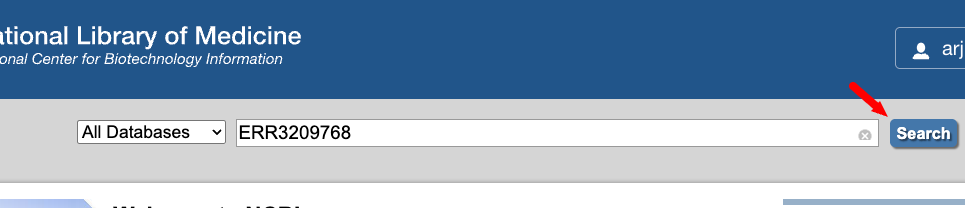
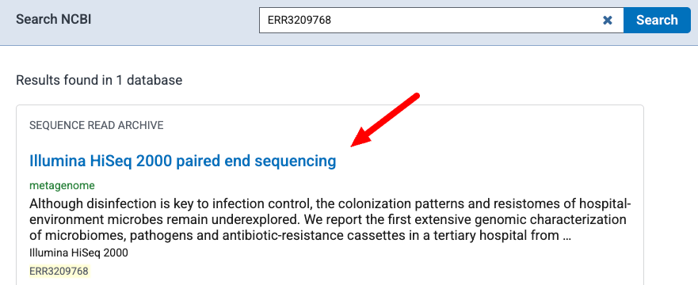
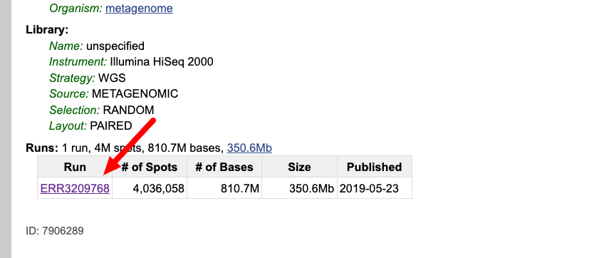
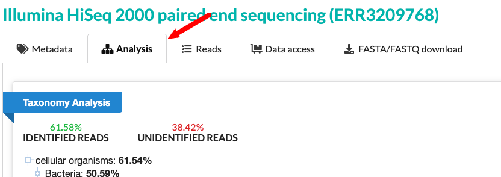
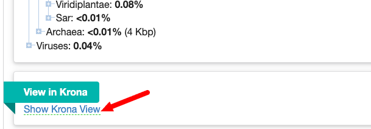
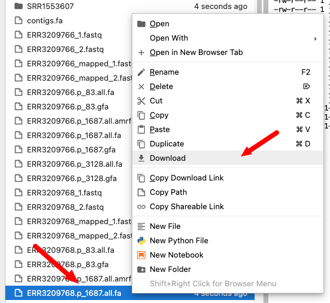
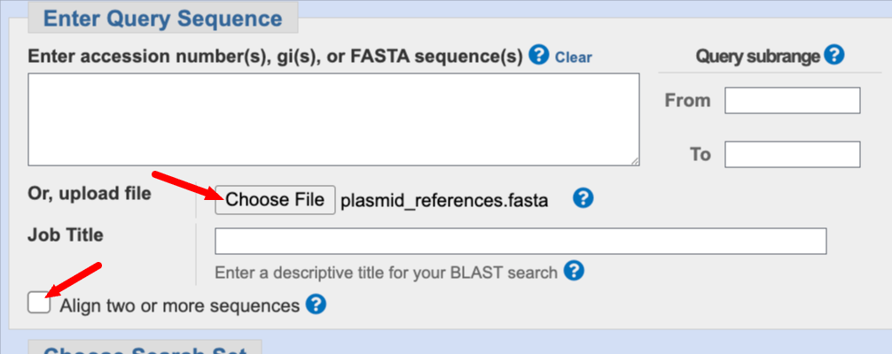
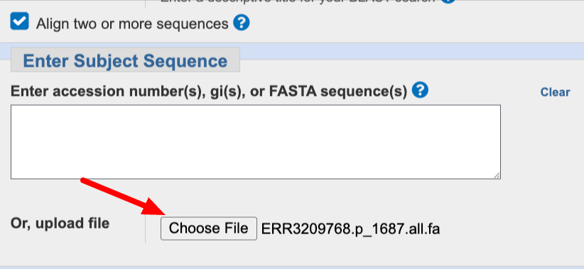
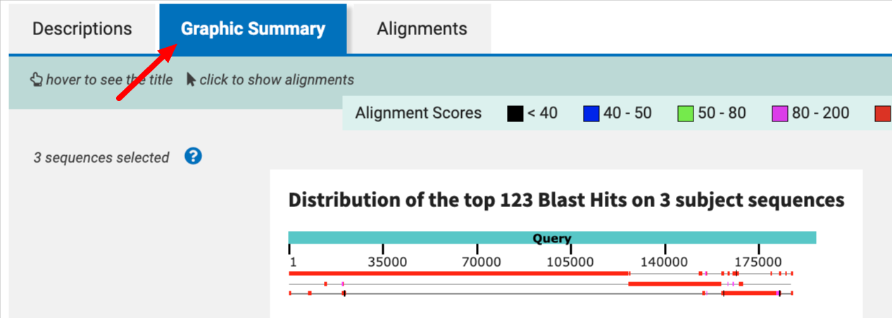

# Plasmids and antimicrobial resistance in hospital metagenomes

Explore DNA sequences from hospital environmental samples to recover plasmid-associated sequences and investigate their resistance genes. First, examine the samples' taxonomic composition. Then, select reads related to published plasmids, assemble those reads, and compare the resulting sequences with public data.

## Background: metagenomes, plasmids, and resistance genes

A **metagenome** contains genetic material sampled from a community of organisms. Shotgun metagenomic sequencing produces short DNA sequences, called **reads**, from that mixture. Unlike sequencing a cultured isolate, it can capture many organisms in one sample, but connecting a sequence to its organism of origin can be difficult. 

**Plasmids** are DNA molecules that replicate separately from bacterial chromosomes. Some carry antimicrobial resistance (AMR) genes and can move between different bacteria. 

An **assembly** joins overlapping reads into longer sequences called **contigs**. In this exercise, published plasmid sequences serve as targets to help select and assemble relevant reads. This focuses the analysis on related sequences; it will not recover every plasmid or resistance gene in the sample. A contig matching part of a plasmid also does not establish that a complete, circular plasmid has been recovered.

Several tools are used in this project:

| Resource or tool | What it contributes |
| --- | --- |
| [SRA Taxonomy Analysis Tool (STAT)](https://www.ncbi.nlm.nih.gov/sra/docs/sra-taxonomy-analysis-tool/) | Estimates the taxonomic composition of sequencing reads using matches to reference k-mers: short DNA words of a fixed length. |
| [BWA-MEM2](https://github.com/bwa-mem2/bwa-mem2) and [SAMtools](https://www.htslib.org/) | Align reads to the plasmid targets and extract a smaller set for assembly. |
| [SAUTE](https://github.com/ncbi/SKESA) | Uses target sequences to create a guided assembly. |
| [Nucleotide BLAST](https://blast.ncbi.nlm.nih.gov/Blast.cgi?PROGRAM=blastn&PAGE_TYPE=BlastSearch) | Aligns assembled sequences to the published plasmids to examine coverage and similarity. |
| [AMRFinderPlus](https://www.ncbi.nlm.nih.gov/pathogens/antimicrobial-resistance/AMRFinder/) | Identifies AMR genes and, with `--plus`, selected stress response and virulence genes. |
| [Pebblescout](https://pebblescout.ncbi.nlm.nih.gov/#view=search) | Finds related sequences in SRA using informative short sequence matches. |
| [NCBI Pathogen Detection](https://www.ncbi.nlm.nih.gov/pathogens/) | Connects matching isolates to metadata and detailed AMRFinderPlus results in MicroBIGG-E. |

## Case study: plasmids in a hospital environment

This project uses data from [Chng et al. (2020), *Cartography of opportunistic pathogens and antibiotic resistance genes in a tertiary hospital environment*](https://www.nature.com/articles/s41591-020-0894-4). The authors surveyed hospital surfaces in Singapore using shotgun metagenomics and long-read sequencing of enriched cultures. Their study recovered a large collection of plasmid sequences and examined hospital environments as reservoirs of microbes and resistance genes.

Here, you will use three published plasmids as targets and two short-read metagenomes from bed-rail samples. These are mixed environmental samples, not cultured isolates. The study's [Supplementary Data 2](https://github.com/NCBI-Codeathons/asm-ngs-workshop/raw/main/blob/supplementary_file_2.xlsx) provides additional sample information.

| SRA run | Sample ID | Collection date | Location | Sample type |
| --- | --- | --- | --- | --- |
| `ERR3209766` | `HMBR127_02` | 2017-11-28 | Floor 8, isolation room 3 | Bed rail |
| `ERR3209768` | `HMBR133` | 2017-11-24 | Floor 11, isolation room 5 | Bed rail |

## Exercise overview

1. **Prepare the targets and reads.** Download published plasmid sequences, select three targets, and obtain and filter reads from two metagenomes.
2. **Explore the sample composition.** Use STAT and its Krona display to examine the taxa represented in a sample.
3. **Assemble and compare sequences.** Run SAUTE and use BLAST to compare the assemblies with the plasmid targets.
4. **Investigate resistance genes and related genomes.** Run AMRFinderPlus, search Pebblescout, and follow a match into Pathogen Detection.

Use the workshop Jupyter environment for terminal commands and file viewing. See [software.md](software.md) for the programs needed. An NCBI account is needed for cross-browser selection in the final step. Downloads and assembly can take several minutes. Allow at least 15 GB of free disk space for these exercises.

> Software versions, database updates, and live browser results can change the exact counts and matches shown in the sample outputs below.

## Exercise: recover and investigate plasmid-associated sequences

### Part 1: prepare plasmid targets and metagenomic reads

#### 1. Open a terminal and create a working directory

In Jupyter, click **+** to open a Launcher, then select **Terminal**. Run these commands one line at a time, pressing **Enter** after each:

```bash
mkdir -p "$HOME/microbiome"
cd "$HOME/microbiome"
pwd
```

`mkdir -p` creates a folder if it does not already exist, `cd` moves into it, and `pwd` prints its path. `$HOME` refers to your home directory on the workshop system. Keep using this working directory for the remaining commands; use `ls` whenever you want to list its files.

For commands spanning several lines, copy and paste the entire block. A trailing backslash (`\`) continues a command on the next line and must be the last character on that line. Wait for the terminal prompt to return before starting the next step.

#### 2. Download published plasmid assemblies and metadata

Download the assembly file from the study's data collection:

```bash
wget -O contigs.fa.gz https://ndownloader.figshare.com/files/21229998
gunzip contigs.fa.gz
```

`wget -O` downloads the file under the specified name. `gunzip` decompresses it to `contigs.fa`, a FASTA file of sequences.

Download the accompanying plasmid information and the authors' analysis repository:

```bash
wget -O plasmid_info.tab https://ndownloader.figshare.com/files/21229983
git clone https://github.com/csb5/hospital_microbiome.git
```

The clone creates a `hospital_microbiome` directory. The selection below uses its `tables/plasmid_info.dat` table; `plasmid_info.tab` is additional metadata you can inspect.

#### 3. Select three plasmid targets

Run:

```bash
grep -Ei 'ctx|ges|tem|shv' hospital_microbiome/tables/plasmid_info.dat | \
    awk '{ if ($5 >= 0) print $0}' | \
    sort -nrk5 | head -3 | cut -f2 > plasmid.list
cat plasmid.list
```

The pipe symbol (`|`) passes one command's output to the next. This pipeline selects rows containing the listed beta-lactamase family terms, sorts them by the number of resistance genes in column 5, and saves the three leading plasmid identifiers from column 2. `>` writes the output to a file, replacing that file if it exists; `cat` displays its contents.

Expected identifiers:

```text
p_1687
p_83
p_3128
```

Extract these sequences and combine them into one target file:

```bash
mkdir -p plasmids

for plasmid in $(cat plasmid.list)
do
    seqkit grep -n -r -p "${plasmid}\$" contigs.fa > "plasmids/${plasmid}.fna"
done

cat plasmids/*.fna > plasmid_references.fasta
```

The `for` loop repeats the extraction for each identifier in `plasmid.list`. SeqKit searches sequence names for that identifier at the end of the name. The wildcard `*` in `plasmids/*.fna` selects all the extracted FASTA files.

#### 4. Download the two metagenomic read sets

Create a file containing the two run accessions. Paste the whole block, including the final `END` line:

```bash
cat > sra.acc <<END
ERR3209766
ERR3209768
END
```

The lines between `<<END` and `END` become the contents of `sra.acc`. Download each run and convert it to paired FASTQ files:

```bash
for acc in $(cat sra.acc)
do
    echo "$acc"
    prefetch "$acc"
    fasterq-dump --split-files "$acc"
    ls -lh "${acc}_1.fastq" "${acc}_2.fastq"
done
```

`prefetch` downloads SRA data, and `fasterq-dump --split-files` writes the paired reads to files ending in `_1.fastq` and `_2.fastq`. Each pair represents sequences from the two ends of a DNA fragment. FASTQ files include sequence quality scores as well as the reads themselves.

#### 5. Select reads for assembly

Index the target sequences, align each read set, and extract paired reads for the next step:

```bash
bwa-mem2 index plasmid_references.fasta

for acc in $(cat sra.acc)
do
    bwa-mem2 mem -t 8 plasmid_references.fasta "${acc}_1.fastq" "${acc}_2.fastq" | \
        samtools view -u -F 8 - | \
        samtools fastq -1 "${acc}_mapped_1.fastq" -2 "${acc}_mapped_2.fastq" \
            -0 /dev/null -s /dev/null -
done
```

BWA-MEM2 aligns the reads to the three targets using eight threads. `samtools view -F 8` excludes alignment records whose mate is unmapped. `samtools fastq` writes paired FASTQ files; the `-s /dev/null` option discards singletons, so this workflow retains pairs with both mates represented after filtering. This produces a smaller input for assembly, but may miss divergent regions and reads extending beyond the targets. The original example took about 3–5 minutes; runtime depends on the system.

Inspect the read counts:

```bash
seqkit stats *.fastq
```

<details>
<summary>Example read counts</summary>

| Run | Reads in each original mate file | Reads in each filtered mate file |
| --- | ---: | ---: |
| `ERR3209766` | 8,296,848 | 41,211 |
| `ERR3209768` | 4,036,058 | 124,749 |

The two filtered mate files for each run should have equal read counts. The counts above are per file, not the sum of both mates.

</details>

How much did filtering reduce each read set? Why might a read matching one of these targets also match another plasmid or a chromosome?

> **If something goes wrong:** Use `pwd` and `ls` to check your directory and input filenames. If a program is not found, consult the [software list](software.md) and ask an instructor for help. If a download or conversion fails, resolve that error before continuing; later steps depend on its output.

### Part 2: explore the sample's taxonomic composition

#### 6. Open the SRA Run Browser

While working with these reads, use STAT to investigate which taxa are represented in the sample. STAT compares read k-mers with a reference database and summarizes the taxonomic assignments; it does not assign a host to each assembled plasmid.

Open the [NCBI homepage](https://www.ncbi.nlm.nih.gov/) and search for `ERR3209768`.



Follow the link to the SRA record.



Click `ERR3209768` in the run table to open the Run Browser, or [open the run directly](https://trace.ncbi.nlm.nih.gov/Traces/?run=ERR3209768).



#### 7. Inspect STAT and the Krona view

Select the **Analysis** tab.



Expand taxa in the list, then select **Show Krona View**. The interactive chart lets you explore the taxonomic hierarchy.



- Which taxa account for large portions of the assigned reads?
- Can you find _Klebsiella_?
- Why would finding _Klebsiella_ reads be insufficient to assign a particular plasmid to that genus?

### Part 3: assemble and compare plasmid-associated sequences

#### 8. Run SAUTE for each sample and target

[SAUTE: Sequence Assembly Using Target Enrichment](https://pmc.ncbi.nlm.nih.gov/articles/PMC8293564/) assembles sequences from reads using targets to guide the search through an assembly graph. Here, the targets are the published plasmids. The reconstructed sequences are supported by the sample reads and may differ from the targets.

Return to the Jupyter terminal and run:

```bash
date
for acc in $(cat sra.acc)
do
    for plasmid in $(cat plasmid.list)
    do
        saute --targets "./plasmids/${plasmid}.fna" \
            --reads "${acc}_mapped_1.fastq,${acc}_mapped_2.fastq" \
            --gfa "${acc}.${plasmid}.gfa" \
            --all_variants "${acc}.${plasmid}.all.fa" --max_variants 1 \
            --target_coverage 0.1 --extend_ends --cores 4
    done
done
date
```

The outer loop visits each sample, and the inner loop visits each plasmid: six assembly runs in total. `--targets` supplies the plasmid sequence and `--reads` supplies the filtered paired reads. `--gfa` saves the assembly graph, while `--all_variants` saves assembled sequences in FASTA format. These workshop settings permit partial target recovery and extend assembled ends where possible. `date` displays the time before and after the runs.

#### 9. Inspect the assemblies

List the output files and summarize their sequence lengths:

```bash
ls -lh *.all.fa
seqkit stats *.all.fa
seqkit fx2tab -l -n plasmids/*.fna
```

`seqkit stats` reports the number and lengths of sequences in each assembly. `seqkit fx2tab -l -n` displays the target sequence names and lengths.

<details>
<summary>Example assembly results</summary>

These results were generated with SAUTE 1.3.0 in the `jupyterhub01` workshop environment on October 2, 2026.

| Assembly file | Number of sequences | Total length (bp) |
| --- | ---: | ---: |
| `ERR3209766.p_1687.all.fa` | 2 | 188,019 |
| `ERR3209766.p_3128.all.fa` | 0 | 0 |
| `ERR3209766.p_83.all.fa` | 3 | 104,427 |
| `ERR3209768.p_1687.all.fa` | 3 | 184,037 |
| `ERR3209768.p_3128.all.fa` | 0 | 0 |
| `ERR3209768.p_83.all.fa` | 3 | 181,725 |

The target lengths in the original example were 195,980 bp for `p_1687`, 145,343 bp for `p_83`, and 227,286 bp for `p_3128`. An empty output means no sequence was reported under these settings; it does not prove the plasmid is absent from the sample. Some SeqKit versions may report an error for an empty FASTA file; inspect the nonempty files individually if needed.

</details>

The original example recovered sequences related to `p_1687` and `p_83` in both samples. Continue with `p_1687`. Total assembly length alone does not measure target coverage: assembled sequences may overlap or extend into other regions.

#### 10. Compare the assemblies with the targets using BLAST

In Jupyter's file browser, right-click `ERR3209768.p_1687.all.fa` and choose **Download**. Also download `plasmid_references.fasta`.



Open [Nucleotide BLAST](https://blast.ncbi.nlm.nih.gov/Blast.cgi?PROGRAM=blastn&PAGE_TYPE=BlastSearch). Under **Query Sequence**, choose `plasmid_references.fasta`, then select **Align two or more sequences**.



Under **Subject Sequence**, choose `ERR3209768.p_1687.all.fa`.



Leave the other settings at their defaults and click **BLAST**.


In the results, select the `p_1687` query and inspect the **Graphic Summary** and individual alignments.



- How much of the target is covered by the assembled sequences?
- Are there gaps, overlapping matches, or changes in alignment orientation?
- How similar are the aligned regions?

The original example showed substantial coverage of `p_1687` across three contigs. Repeat the comparison using `ERR3209766.p_1687.all.fa` as the subject. Use the alignments to assess what was recovered; partial matches alone do not establish a complete plasmid.

### Part 4: investigate resistance genes and related genomes

#### 11. Run AMRFinderPlus on the assemblies and target

Compare the two `p_1687` assemblies with the published target:

```bash
amrfinder -V
amrfinder -n ERR3209766.p_1687.all.fa --plus -o ERR3209766.p_1687.amrfinder.tsv
amrfinder -n ERR3209768.p_1687.all.fa --plus -o ERR3209768.p_1687.amrfinder.tsv
amrfinder -n plasmids/p_1687.fna --plus -o p_1687.amrfinder.tsv
```

`-n` supplies nucleotide sequences, `--plus` includes selected stress response and virulence genes, and `-o` saves a table. Note the software and database versions printed by `amrfinder -V`. These are nucleotide-only searches: no protein annotation is supplied. We omit `--organism` because the host of these metagenomic sequences has not been established.

#### 12. Compare the AMRFinderPlus results

Open each `.tsv` file in Jupyter's file browser. If it opens as text, right-click and select **Open With → TSV Viewer**.

Compare **Element symbol**, **Type**, **Class**, **Method**, **% Coverage of reference**, and **% Identity to reference**. Older versions use **Gene symbol** in place of **Element symbol**. See [Interpreting AMRFinderPlus results](https://github.com/ncbi/amr/wiki/Interpreting-results) for field and method definitions.

- Which resistance genes occur in both the target and the reconstructed sequences?
- Which results differ between the samples or the target?
- Do partial hits in the target have more complete matches in your assemblies?

<details>
<summary>Interpret the original example</summary>

The original workshop example reported more genes in the reconstructed sequences and several `PARTIALX` hits in the published target. A `PARTIALX` result is a partial match found through a translated nucleotide search. More complete matches can suggest improved recovery of individual genes, but a larger gene count alone does not establish a better assembly: sequence differences, extensions, and assembly errors can also affect the results.

Use the BLAST alignments and AMRFinderPlus match evidence together. Gene detection describes sequence content; it does not measure the antibiotic susceptibility of an organism in this mixed sample.

</details>

#### 13. Search for related sequences with Pebblescout

[Pebblescout](https://pebblescout.ncbi.nlm.nih.gov/#view=search) searches indexed sequence collections using short sequence matches, giving more weight to informative matches. It helps identify records for closer investigation; use alignments to assess their detailed similarity.

1. Open Pebblescout and click **Choose File**.
2. Select the downloaded `ERR3209768.p_1687.all.fa` file.
3. Select the **WGS, Volume 1** index used in the original exercise, if available. If the available indexes have changed, select an appropriate WGS assembly index and record its name.
4. Click **View** to submit the search and display the results.
5. Examine **%coverage** and **PBSscore**, then follow BioSample links for several strong matches.

These scores summarize sequence matches in the selected index; they are not BLAST percent identity. Consult the [Pebblescout introduction](https://ncbiinsights.ncbi.nlm.nih.gov/2023/09/14/introducing-pebblescout/) for the search approach.

Which organisms appear among the strong matches, and what do the sample metadata tell you about their sources?

<details>
<summary>Interpret the original example</summary>

Several original matches had more than 90% coverage and were associated with _Klebsiella pneumoniae_ assemblies. This suggests that related sequences occur in genomes assigned to that species. Plasmids can move between hosts, so these matches do not establish which organism carried the sequence in either bed-rail sample.

</details>

#### 14. Follow a match into Pathogen Detection

Choose a matching BioSample to investigate. The original example used **`SAMN16824518`**; you can [open its Isolates Browser search](https://www.ncbi.nlm.nih.gov/pathogens/isolates/#SAMN16824518).

Inspect the **Location**, **AMR genotypes**, and **SNP cluster** fields. The original record had no SNP cluster assignment; check its current status rather than assuming it is unchanged.

Sign in to NCBI, click **Cross-browser selection**, and choose **Show in MicroBIGG-E**. Alternatively, search for the BioSample directly in [MicroBIGG-E](https://www.ncbi.nlm.nih.gov/pathogens/microbigge/#SAMN16824518).

Sort by **Contig** and compare the resistance elements with your AMRFinderPlus results. Finding genes together on a contig adds information about their genomic context, although a shared gene list alone does not prove that two sequences represent the same plasmid.

- Which resistance genes are shared with your reconstructed sequences?
- Are they located together on a contig in the matching assembly?
- What additional sequence comparison would strengthen the case that these are related plasmids?

## Optional extension: compare a matching assembly

Use [NCBI Datasets](https://www.ncbi.nlm.nih.gov/datasets/) to download one of the assemblies identified through Pebblescout. Find contigs that align to your reconstructed sequence and compare alignment coverage, sequence identity, and resistance-gene organization. Explain which observations support a related plasmid and which questions remain unresolved.
