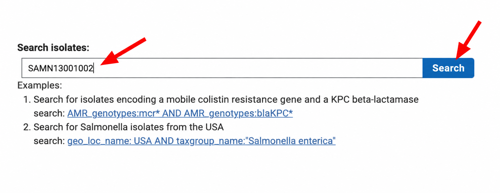
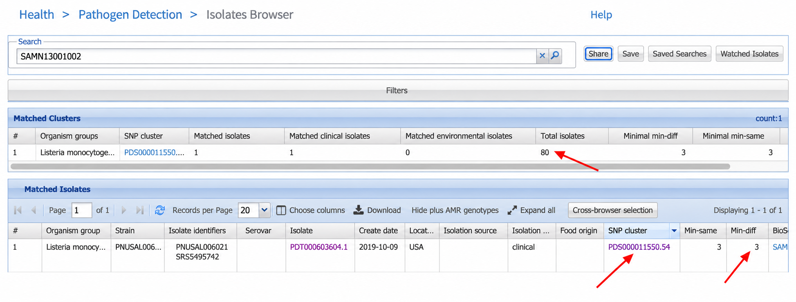
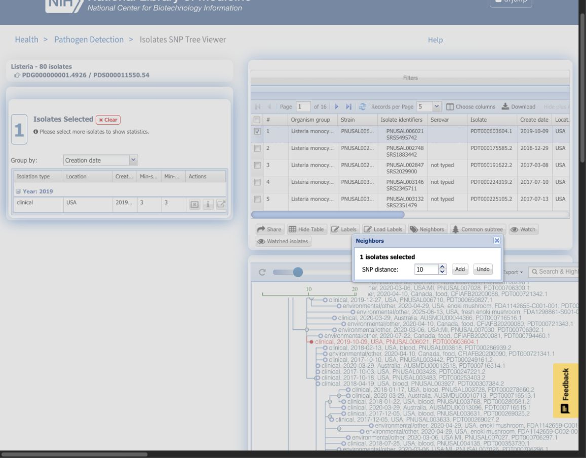
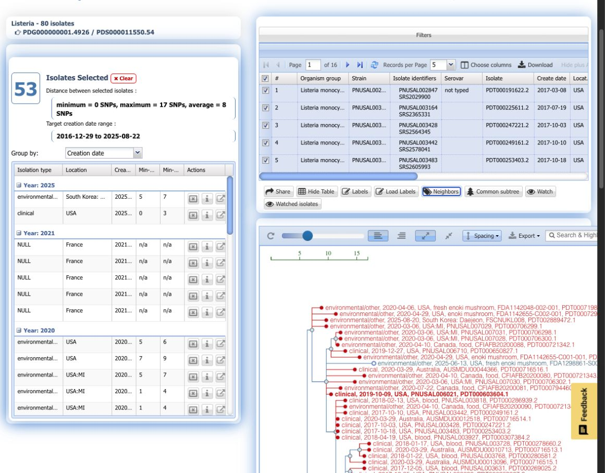

# Outbreak investigation with NCBI Pathogen Detection

Use this exercise to find a clinical isolate, identify closely related isolates, and explore how genomic data can help investigators identify a possible source of infection.

## Background: NCBI Pathogen Detection

[NCBI Pathogen Detection](https://www.ncbi.nlm.nih.gov/pathogens/) brings together pathogen genome sequences from public health surveillance and research around the world. These include isolates from patients, food, and environmental sources such as water and food production facilities. By analyzing these data together, the system helps investigators discover connections across laboratories, countries, and time.

Pathogen Detection groups genetically related isolates into clusters. Investigators can search the **Isolates Browser** for an isolate and explore its relatives in the **SNP Tree Viewer**. A single-nucleotide polymorphism (SNP) is a difference at one position in a DNA sequence; SNP distances help describe how closely related isolates are. The system also uses AMRFinderPlus to identify antimicrobial resistance, stress response, and virulence genes in bacterial genomes.

This exercise focuses on using genomic relationships and sample metadata to generate leads for an outbreak investigation. Genetic similarity is a clue: investigators also need epidemiologic and food traceback evidence to establish the source of an outbreak.

## Case study: the enoki mushroom outbreak

This exercise uses the [2016–2020 outbreak of _Listeria monocytogenes_ linked to enoki mushrooms](https://pmc.ncbi.nlm.nih.gov/articles/PMC10947956/). U.S. investigations began in 2017, but the food source remained unidentified for several years. The U.S. outbreak ultimately included 36 illnesses, four deaths, and two fetal losses.

In February 2020, the Canadian Food Inspection Agency uploaded sequences from mushroom isolates to NCBI Pathogen Detection, including an isolate from imported enoki mushrooms sampled in 2019. Comparisons connected these food isolates to the unresolved U.S. outbreak and helped launch a multinational investigation. Investigators linked illnesses in the United States and Canada to enoki mushrooms from a manufacturer in the Republic of Korea. Australia investigated related illnesses, and France identified related isolates from enoki mushrooms but reported no linked illnesses.

The investigation illustrates why sharing sequence data and sample metadata matters: food isolates collected in one country can provide a crucial lead for illnesses in another.

## Exercise: investigate a clinical isolate

Imagine you have sequenced a clinical _L. monocytogenes_ isolate and submitted its data to NCBI Pathogen Detection. See also [How to Submit Data for Real-Time Analysis
](https://www.ncbi.nlm.nih.gov/pathogens/submit-data/).

For this exercise, use:

- **BioSample accession:** `SAMN13001002`
- **Sequence Read Archive (SRA) run accession:** `SRR10252179`

### 1. Find the isolate

Open the [NCBI Pathogen Detection homepage](https://www.ncbi.nlm.nih.gov/pathogens/) and search for `SAMN13001002`, or go directly to the [isolate search results](https://www.ncbi.nlm.nih.gov/pathogens/isolates/#SAMN13001002).

*Enter the BioSample accession in **Search isolates**, then click **Search**. Screenshots in this exercise were captured on October 4, 2026; live results may change.*

### 2. Examine the search results

Locate the **SNP cluster** and **Min-diff** fields for the isolate.

- Record the cluster size. The original workshop example showed 80 isolates.
- Check **Min-diff**. This is the smallest SNP distance to an isolate of a different isolation type within the cluster. For a clinical isolate, it describes the closest environmental/other match, which can include food isolates.
- The original example showed a **Min-diff of 3**: a nonclinical isolate differed from the clinical isolate by only three SNPs. Inspect its metadata to find out where it came from.

Cluster size describes how many isolates are grouped together; it does not, by itself, identify a food or environmental match. See the [Pathogen Detection help](https://www.ncbi.nlm.nih.gov/pathogens/pathogens_help/) for field definitions.

> Pathogen Detection is updated as data are added and reanalyzed. Cluster membership, sizes, and SNP distances may differ from the original workshop example.

*Read **Total isolates** in the upper **Matched Clusters** table (80 here). In the lower **Matched Isolates** table, read **Min-diff** (3 here) and click the **SNP cluster** accession to open the tree.*

### 3. Explore the SNP cluster

Click the isolate's **SNP cluster** accession (e.g., `PDS000011550.54`) directly in the search results table to open the tree in the SNP Tree Viewer. Clicking the accession link in the table is recommended because it dynamically resolves to the latest version of the tree and organism group.

Use the tree and metadata to investigate:

- Which isolates are closest to the clinical isolate? Select multiple nodes to inspect their SNP distances in the left panel.
  > **Tip:** You can click the **Neighbors** button below the table and enter a SNP distance (e.g., 10) to automatically select closely related isolates, rather than clicking individual nodes in the tree.
- Can you find Canadian food isolates? What does their isolation source tell you?
- How do the collection dates compare with the dates the records were created? These represent different events: sampling and entry into the database.
- What hypothesis about the source of infection would you investigate next, and what additional evidence would you need?

*With the clinical isolate selected, click **Neighbors**, enter **10** in **SNP distance**, and click **Add**.*

*Inspect the distance summary on the left and the isolate labels in the tree. Here, the 10-SNP neighbor selection includes 53 isolates, and the summary reports distances among all selected isolates (0–17 SNPs), not just distances from the starting isolate. Look for Canadian isolates labeled **food**. The **Watch** button is used in the optional step below.*

Click to reveal discussion notes and answers

- **Closest isolates and SNP distances:** Selecting the clinical isolate and neighboring isolates reveals that several environmental and clinical isolates differ by only 1 to 4 SNPs, indicating a very tight clonal cluster.
- **Canadian food isolates:** Several isolates (such as `CFIAFB20200088` and `CFIAFB20200080`) submitted by the Canadian Food Inspection Agency (CFIA) list the isolation source simply as `food`. Subsequent US FDA isolates explicitly specify `enoki mushroom` or `fresh enoki mushroom`, demonstrating how metadata terminology can differ between agencies during surveillance.
- **Collection vs. creation dates:** Canadian isolates sampled in 2016 and 2019 were entered into the database in early 2020. The collection date reflects when the physical sample was obtained, while the creation date reflects when sequence data were uploaded. Depositing older surveillance sequences in 2020 provided the breakthrough match needed to connect ongoing 2016–2020 clinical cases in the United States and Canada.
- **Investigative hypothesis and additional evidence:** The primary hypothesis is that clinical illnesses were caused by consumption of contaminated enoki mushrooms distributed through commercial supply chains linked to the common suppliers identified by CFIA and FDA traceback. To confirm this, investigators required patient exposure questionnaires confirming enoki mushroom consumption, supply chain traceback connecting retail purchases to specific mushroom farms, and confirmatory environmental swab cultures from the production and packaging facilities.

### 4. Optional: follow new matches

Sign in to My NCBI to **save a search** in the Isolates Browser or **watch selected isolates** in the SNP Tree Viewer. Saved searches notify you of new matching records; watches notify you of new isolates within a chosen SNP distance. See the [notification instructions](https://www.ncbi.nlm.nih.gov/pathogens/pathogens_help/#automated-searches) for details.
